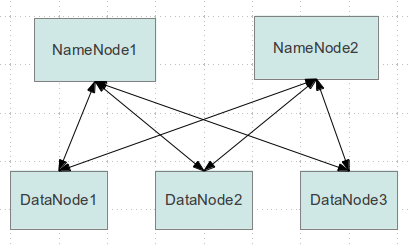
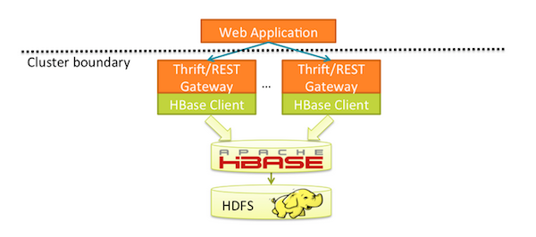

# BigData Fun
I wanted to learn more about big data, and some of the key tools in the market.

As a result, I decided to create an all in one docker environment, including distributed filesystem (HDFS).

The key components are:

- [HDFS](http://hortonworks.com/apache/hdfs) - Distributed file system, including two data nodes
- [HBase](http://hortonworks.com/apache/hbase) - Non-relational, distributed database similar to Google BigTable
- [Hue](http://gethue.com) - Web interface for analyzing data
- [Flume](https://flume.apache.org/) - Apache flume, for getting some data in

The following components will be coming soon:

- [Solr](http://lucene.apache.org/solr/) - Search platform based on Lucene
- [Spark](http://spark.apache.org/) - Data processing engine

## Getting started
Oh the joy, it's so easy.  Just make sure you have docker installed, and docker-compose.  Be aware that I do use v2 networking, so make sure you're up to date.  I built all of this on the following versions of things:

```

```

To get started, run: `docker-compose up`

Give it a minute to get its ducks in line, and then access the key things you'll be interested in:

- Hue UI: [http://127.0.0.1:8888](http://127.0.0.1:8888)
- HDFS NameNode UI: [http://127.0.0.1:50070](http://127.0.0.1:50070)
- Thrift UI: [http://127.0.0.1:9095](http://127.0.0.1:9095)
- HBase Master UI: [http://127.0.0.1:16010](http://127.0.0.1:16010)
- HBase Region UI: [http://127.0.0.1:16030](http://127.0.0.1:16030)

## The components in detail

### Hadoop HDFS (2.7.3)

 - namenode
 - datanode1
 - datanode2

This is a HDFS cluster running two datanodes.  Each of these run in their own container too.



### HBase (1.3.0)

 - hbase_zookeeper
 - hbase_master
 - hbase_regionserver

This setup is designed to replicate a fully distributed setup, subsequently we're running in distributed mode and running separate instances (containers) of the following:

The HBase container can be run in standalone mode too, if you want - which will result in less JVMs, but a less production like environment.  To run HBase in standalone mode, run the HBase container with `HBASE_MANAGES_ZK=true`, `HBASE_CONF_DISTRIBUTED=false` and `HBASE_CONF_QUORUM=hbase-master`.

You can read more about the modes [here](http://hbase.apache.org/0.94/book/standalone_dist.html).


#### Rest/Thrift

 - hbase_thrift
 - hbase_rest

The rest & thrift interfaces sit on top of the cluster, you can stop them if you don't need them.



### Hue (latest)
 
 - [Hue](https://github.com/cloudera/hue) 

When you first use Hue, it does a health check and will tell you that a bunch of stuff isn't configured correctly, that's fine as I don't plan to build the whole Cloudera stack, just 'next next next' thought it and use the components that matter, like the [HBase Browser](http://127.0.0.1:8888/hbase/#hbase).


### Flume (1.7.0)
  
 - flume

I wanted a way to stream data into Hadoop or HBase easily.  That's what this container does.  It includes the java classes for hbase and hadoop too so those sinks will work.  By default, docker-compose will mount `./data/flume`, and any files you place in there will be 'flumed' into a HBase table called `flume_sink`, with the column family `cf`.  That's all config driven though so edit `./config/flume/flume-conf.properties` to change that behaviour.  
  
In order for the HBase aspect to work, you need to create the table first, that's easiest via the hbase shell.

```
$ docker-compose exec hbase_master hbase shell
HBase Shell; enter 'help<RETURN>' for list of supported commands.
Type "exit<RETURN>" to leave the HBase Shell
Version 1.3.0, re359c76e8d9fd0d67396456f92bcbad9ecd7a710, Tue Jan  3 05:31:38 MSK 2017

hbase(main):001:0> create 'flume_sink', 'cf'
0 row(s) in 2.5370 seconds

=> Hbase::Table - flume_sink
hbase(main):002:0>
```

If you've started flume before creating this table, you'll be seeing errors like this:
```
org.apache.flume.FlumeException: Error getting column family from HBase.Please verify that the table flume_sink and Column Family, cf exists in HBase, and the current user has permissions to access that table.
```

Simply do a `docker-compose restart flume` and it'll sort itself out.


## Credits
The HDFS work has been tackled beautifully by [https://github.com/big-data-europe/docker-hadoop](https://github.com/big-data-europe/docker-hadoop), so I'm using a lot of what they did for the hadoop namenodes and datanodes.

## TODO
- Solr
- Spark
